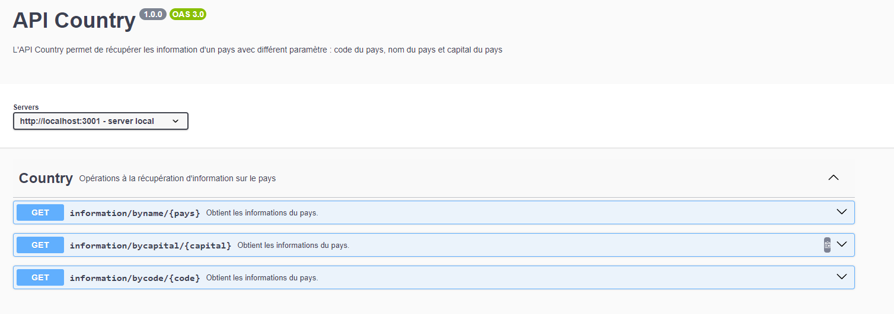
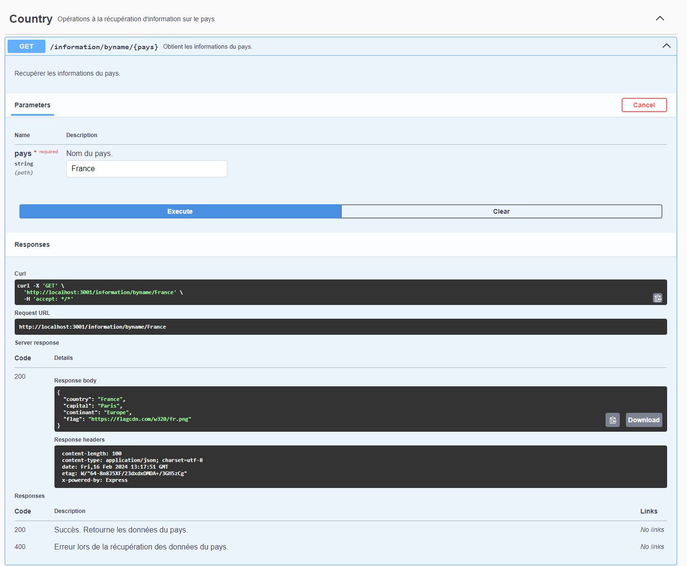

# API Country

## Description

`Api Country` est une API qui permet de récupérer les informations de pays en y informant différent paramètre.
### exemple

Vous pouvez récupérer les informations d'un pays à l'aide : 

- du nom du pays;
- du code pays;
- de la capital du pays.

## Installation du projet

1. Vous pouvez récupérer le projet sur le repos Git : [Api Country](https://github.com/addevelop/apiCountry)  
2. Une fois récupéré, ouvrez un `Terminal de commande` et positionnez vous dans le répertoire du projet.
  
3. Tapez la commande `npm install` pour installer les packages nécessaire au bon fonctionnement du projet.

## Lancement du projet

1. Une fois les packages installé, tapez la commande `npm start`, se qui lancera le serveur du projet et vous permettra de faire les requêtes à l'API.
  
2. Allez sur votre navigateur et mettez comme url http://localhost:3001/api-docs, si ce port ne fonctionne pas essayez avec le port [3000](http://localhost:3000/api-docs).
  
3. Vous avez du atterrir sur la docs de l'API et vous pouvez tester les requêtes directement depuis cette docs.
  

## Documentation de l'API

### image de la documentation

  

### Requête

